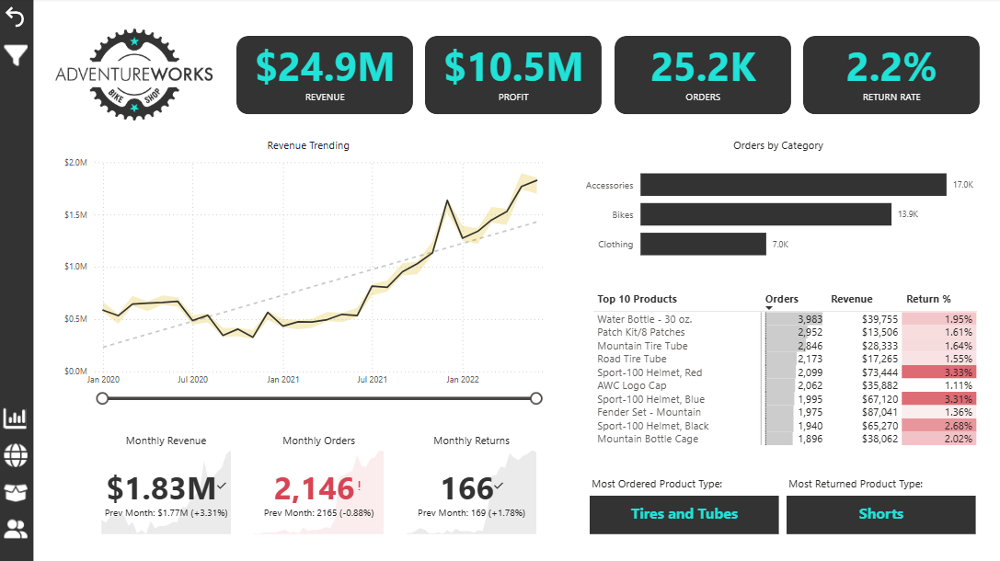

# Portfolio
# Gallery 1 - Power BI

# Gallery 2 - Tableau
# Gallery 3 - Case Study
# YouTube Videos
# About Me
- 👋 Hi, I’m @acshivers
- 👀 I’m interested in coding for data analysis
- 🌱 I’m currently learning Python 3, pandas, BeautifulSoup, MechanicalSoup
- 💞️ I’m looking to collaborate on pandas exercises
- 📫 How to reach me? Send and email to arturo.shivers@gmail.com  
- 😄 Pronouns: He, Him, His
- ⚡ Fun fact: I am a designee of the WSET2 with Distinction, in wines
# Links URL
LinkedIn
Fiverr.com
Freelancer.com
Upwork.com 

<!---
acshivers/acshivers is a ✨ special ✨ repository because its `README.md` (this file) appears on your GitHub profile.
You can click the Preview link to take a look at your changes.
--->
